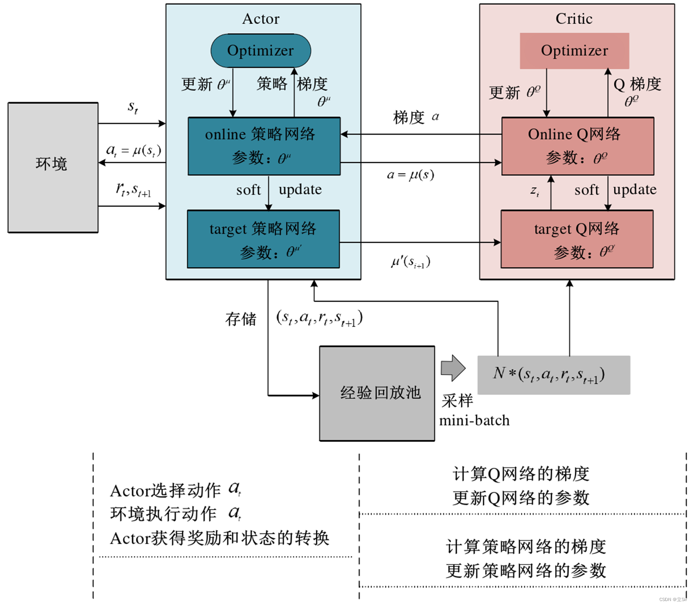
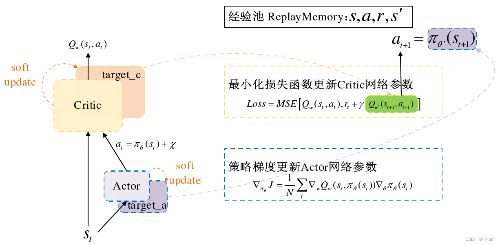

DDPG Algorithm
Randomly initialize critic network $Q(s, a|\theta^Q)$ and actor $\mu(s|\theta^\mu)$ with weights $\theta^Q$ and $\theta^\mu$
Initialize target network $Q'$ and  $\mu'$ with weights $\theta^{Q'} \leftarrow \theta^Q$ and $\theta^{\mu'} \leftarrow \theta^\mu$
Initialize replay buffer R
for episode = 1, M do
&emsp; Initialize a random process $N$ for action exploration
&emsp; Receive initial observartion state $s_1$
&emsp; for t = 1, T do
&emsp;&emsp; select action $a_t = \mu(s_t|\theta^\mu) + N_t$ according to the current policy and exploration noise
&emsp;&emsp; execute action $a_t$ and observe rerward $r_t$ and observe new state $s_{t+1}$
&emsp;&emsp; store transition $(s_t, a_t, r_t, s_{t+1})$ in R
&emsp;&emsp; sample a random minibatch of N transitions $(s_t, a_t, r_t, s_{t+1})$
&emsp;&emsp; set $y_i = r_i + \gamma Q'(s_{i+1}, \mu'(s_{i+1}|\theta^{\mu'}) | \theta^{Q'})$
&emsp;&emsp; update critic by minimizing the loss: $L = \frac{1}{N}\sum_{i}{(y_i - Q(s_i, a_i | \theta^Q))^2}$
&emsp;&emsp; update the actor policy using the sample policy gradient:

$$
\nabla_{\theta^\mu} J \approx \frac{1}{N}\sum_i{\nabla_a Q(s, a | \theta^Q) | _{s=s_i, a=\mu(s_i)} \nabla_{\theta^\mu} \mu (s | \theta^\mu) | _{s_i}}
$$

&emsp;&emsp; update the target networks:

$$
\theta^{Q'} \leftarrow \tau \theta^Q + (1 - \tau)\theta^{Q'} \\
\theta^{\mu'} \leftarrow \tau \theta^\mu + (1 - \tau)\theta^{\mu'}
$$

&emsp; end for
end for

main
initialize
loop
save NN model

agent
critic network
actor network
replay buffer
DDPGAgent

test
load actor model
pygame render

# Reinforcement Learning (RL)

**agent** observes the **state** from **environment** and takes an **action** based on **policy**, then environment gives **reward** and transfers to new state, agent takes new actions based on new states and former reward continuously for the **maximum** of the reward.

### differences between SL and RL

RL has similarities with Supervised Learning (SL), but also significant differences:

- the samples in SL need to be IID, the (state, action) of RL is not.
- in SL, label is prepared simultaneously with sample, while the "label" - reward - is generated after (s, a). And the reward is long-term and can not directly guide which actions should be taken.
- the generation and training of samples in SL is an open-loop, while that in RL is a closed loop where we can get new samples for training after application.

### features of RL compared with SL and USL

a RL system can be described by 4 elements: a policy, a reward signal, a value function, and optionally a model of the environment.

- exploration-exploitation dilemma, for long-term reward, agent not only take actions that are known good, but also try unknown actions which might be better.
- try to directly solve the interaction problem of agent and environment.

### MDP

|                 |         no action         |                     has actions                    |
|:---------------:|:-------------------------:|:--------------------------------------------------:|
|  visible state  |     Markov Chain (MC)     |            Markov Decision Process (MDP)           |
| invisible state | Hidden Markov Model (HMM) | Partially Observed Markov Decision Process (POMDP) |

MDP model: (T, S, A, P, R), i.e. epoch, state, action, transition probability, reward.

1. policy, $\pi$, which models the behavior of agent and is classified:
   1. stochastic policy, $p(a|s)$ generates a probability  of a state.
   2. deterministic policy, $a=\pi(s)$ directly taking the action most probable.
2. the goal of MDP is to get a policy which can maximize reward.
3. when pursuing maximum of reward, the optimal policy is bound to be deterministic policy.
4. assuming S and A are finite.

